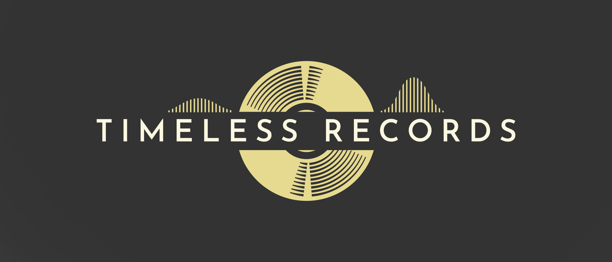

# The beginning of Timeless

**By Keith Paterson – March 27, 2025**

Hi! 
We're a new, small, independent record label counting down to opening night, and we can't wait to get started! 

It’s hard to miss how much the music world has changed since the ’90s and early 2000s: artists can now distribute their own music online, manage self-promotion through social media, and essentially become their own small business with themselves as the brand. This can, however, mean so much more is expected of them, and the juggling act can leave very little room for the creative spark of making music - and isn't that what is was all supposed to be about in the first place?

At Timeless Records, we want to balance the scales for artists who crave the freedom to create, without the grind of business admin, the tech rabbit-holes and relentless self-promotion. We’re not aiming to become an empire; we’d rather partner with musicians who have that indescribable connection to music and allow them space to flourish.

So why “Timeless”? We believe great music transcends eras. It’s a nod to drawing inspiration from the past, embracing new technology as it comes, and forging a true connection with fans who feel music in their bones. It’s about moving forward while holding onto the soul that makes a song unforgettable.

Right now, we’re getting everything ready for our official start, and we’re delighted to announce our very first release is coming on April 25. We can’t wait to share it with you. If you’re an artist who’s ready to collaborate instead of doing it all alone—or a listener who believes music is meant to resonate beyond trends—we hope you’ll join us. Let’s make something that stands the test of time, together.